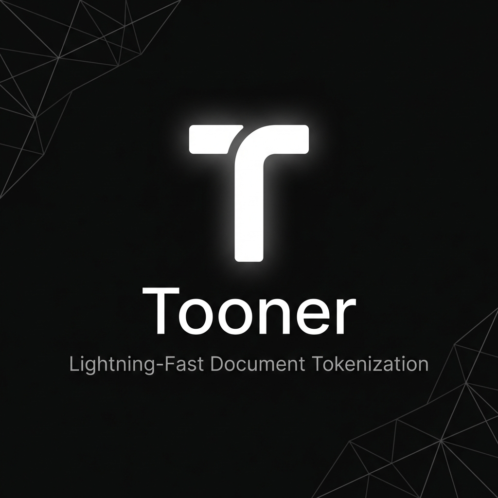

<p align="center">
  
</p>

<p align="center">
  <a href="https://tooner.sdad.pro"><strong>tooner.sdad.pro</strong></a> ·
  <a href="#features">Features</a> ·
  <a href="#quick-start">Quick Start</a> ·
  <a href="#architecture">Architecture</a> ·
  <a href="#tech-stack">Tech Stack</a>
</p>

<p align="center">
  
  
  
</p>

---

**Tooner** converts documents, data files, and code into token-optimized `.toon` files for feeding into LLMs. All processing happens in your browser. Zero servers. Zero uploads.

[Try it now →](https://tooner.sdad.pro)

## Features

- **100% Private** — Files never leave your machine. No server, no upload, no analytics.
- **Token-Optimized** — Reduce token count via smart content extraction + gzip compression.
- **10+ Formats** — PDF, DOCX, XLSX, CSV, JSON, XML, Markdown, code files, and more.
- **LLM-Ready Output** — `.toon` files work directly in ChatGPT, Claude, Gemini. Copy text or download.
- **Lazy-Loaded** — Heavy deps (PDF.js, SheetJS, Mammoth, gpt-tokenizer) load on demand.
- **Dark Editorial UI** — Airtable-inspired palette with GSAP + Framer Motion animations, Lenis smooth scroll.

## Quick Start

```bash
git clone https://github.com/instax-dutta/tooner.git
cd tooner
npm install
npm run dev       # → http://localhost:5173
npm run build     # → dist/
npm run test      # ~22 tests, vitest
```

## Architecture

### Converter Registry

Tooner uses a priority-sorted converter registry. Each format is a standalone class extending `DocumentConverter`:

```
src/converters/
  DocumentConverter.js    # Abstract base (accepts + convert)
  Registry.js             # Priority-sorted dispatch, singleton
  fileTypeDetector.js     # Magic bytes → MIME → extension detection
  StreamInfo.js           # Immutable metadata value object
  PlainTextConverter.js   # Fallback at priority 10
  PdfConverter.js         # priority 0
  DocxConverter.js        # priority 0
  ExcelConverter.js       # priority 0 (XLSX/XLS)
  CsvConverter.js         # priority 0
  JsonConverter.js        # priority 0
  XmlConverter.js         # priority 0
```

**Flow**: `DropZone → registry.convert(file, onProgress) → fileTypeDetector.detectFileType() → sorted iter accepts() → first match calls convert() → { content, format } → tokenizer (lazy) → .toon`

### State Machine

```
idle → processing → done → idle
                  ↘ error ↗
```

Four states rendered via Framer Motion `AnimatePresence mode="wait"`.

### File Detection

3-tier: magic bytes (first 4096 bytes) → browser `file.type` → extension fallback. ZIP-based disambiguation for `.docx` vs `.xlsx` vs `.pptx`.

## Supported Formats

| Category | Extensions |
|----------|-----------|
| **Documents** | `.pdf` `.docx` `.txt` `.md` `.rtf` |
| **Data** | `.csv` `.xlsx` `.xls` `.json` `.xml` `.yaml` `.yml` `.toml` |
| **Code** | `.js` `.jsx` `.ts` `.tsx` `.py` `.java` `.cpp` `.c` `.h` `.hpp` `.cs` `.go` `.rs` `.rb` `.php` `.swift` `.kt` `.html` `.css` `.scss` `.less` `.sql` `.sh` `.bash` `.zsh` |

All code/markup formats beyond the dedicated converters fall through to `PlainTextConverter`, which accepts anything with a `text/*` MIME type or matching extension.

## .toon Format

```json
{
  "version": "1.0",
  "lossless": true,
  "original": {
    "filename": "report.pdf",
    "format": "pdf",
    "size": 1048576,
    "tokens": 25000
  },
  "optimized": {
    "content": "<base64-gzip-compressed>",
    "encoding": "utf-8",
    "compression": "gzip",
    "tokens": 14500
  },
  "metadata": {
    "created": "2026-06-03T16:00:00Z"
  }
}
```

The content field is gzip-compressed at level 9 (`fflate`) and base64-encoded. Structured data (JSON) is additionally TOON-encoded via `@toon-format/toon`.

## Tech Stack

| Layer | Libraries |
|-------|-----------|
| **Framework** | React 19, Vite 7 |
| **Styling** | Tailwind CSS 4, CSS custom properties |
| **Animation** | GSAP 3.14, Framer Motion 12, Lenis 1.x |
| **Converters** | PDF.js 5.x (local worker via `?url` import), Mammoth, SheetJS, PapaParse |
| **Tokenization** | gpt-tokenizer, fflate (gzip level 9) |
| **Format** | @toon-format/toon 2.1 |
| **Testing** | Vitest (~22 tests) |
| **Lint** | ESLint 9, eslint-plugin-react, eslint-plugin-react-hooks |

### Code Splitting

Manual chunk config in `vite.config.js`:

```
pdf          → pdfjs-dist
excel        → xlsx
docx         → mammoth
csv          → papaparse             (~19 KB gzipped)
gzip         → fflate
gpt-tokenizer → gpt-tokenizer        (~1 MB gzipped)
toon         → @toon-format/toon
motion       → framer-motion         (~42 KB gzipped)
gsap         → gsap                  (~27 KB gzipped)
lenis        → lenis
```

Main app bundle: ~217 KB (67 KB gzipped). All others load dynamically during processing.

## Deployment

### Netlify

Deploys from `main` branch. `netlify.toml` handles build config, security headers, immutable asset caching (1 year), and SPA redirects. Custom domain: `tooner.sdad.pro`.

```bash
npm run build
# Serve dist/ on any static host — zero server required
```

## License

MIT © [sdad.pro](https://sdad.pro)

---

<p align="center">
  <a href="https://tooner.sdad.pro">tooner.sdad.pro</a> ·
  <a href="https://sdad.pro">sdad.pro</a> ·
  <a href="https://github.com/instax-dutta/tooner">GitHub</a>
</p>
