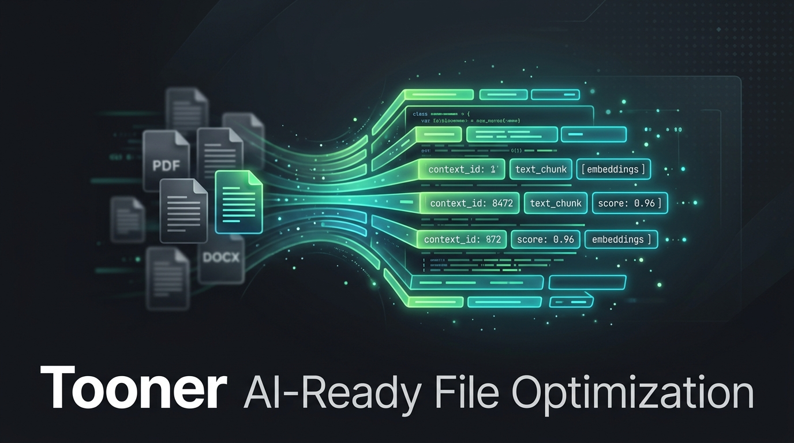

<p align="center">
  
</p>

<p align="center">
  <a href="https://tooner.sdad.pro"><strong>tooner.sdad.pro</strong></a> ·
  <a href="#features">Features</a> ·
  <a href="#quick-start">Quick Start</a> ·
  <a href="#architecture">Architecture</a> ·
  <a href="#tech-stack">Tech Stack</a>
</p>

<p align="center">
  
  
  
</p>

---

### Stop paying LLMs to read layout formatting bloat.

Tooner is a 100% client-side, privacy-first web utility that converts documents, raw database tables, and codebases into token-optimized `.toon` files. By combining **MarkItDownJS** with format-aware semantic parsers and heading-based chunk splitters, Tooner trims down token overhead by **15% to 40%** before you paste your files into ChatGPT, Claude, or Gemini.

[Deploy to Netlify or Run Locally — 100% sandboxed in your browser →](https://tooner.sdad.pro)

---

## Why Tooner? (Core Value Positioning)

*   **RAG-Ready Heading Splitting:** Splits documents dynamically on Markdown heading boundaries (`#`, `##`) and paragraph limits to generate index-ready RAG chunks with pre-calculated token sizes.
*   **Zero Server Risk (Risk Reversal):** Proprietary source code, PDF transcripts, and raw database sheets never leave your device. All parsers (PDF.js, mammoth, SheetJS, MarkItDownJS) execute locally in your browser sandbox using client-side JavaScript and WebAssembly.
*   **Semantic Noise Collapsing:** Strips out token-guzzling boilerplate: HTML/XML comments, decorative badge svgs, repeating CSV/XLSX header lists, trailing spacing, and multiple column-alignment blanks.
*   **Base64 Gzip Packing:** Packs the final optimized layout into a highly compressed, portable `.toon` block that decreases raw file sizes by up to 99%.

---

## Features

*   **100% Private** — Runs entirely client-side. Zero server uploads. Zero telemetry.
*   **MarkItDownJS Engine** — The core document extraction layer is powered by `@markitdownjs/core` for premium Markdown generation.
*   **12+ Supported Formats** — PDF, DOCX, PPTX, XLSX, XLS, EPUB, CSV, JSON, XML, HTML, Markdown, and source code.
*   **Format-Aware Compression** — Dedicated optimizers in `src/utils/tokenizer.js` route content based on type (markdown, data, XML, JSON, HTML, and code).
*   **Lazy-Loaded Bundle** — Heavy parsers (PDF workers, sheet sheet-readers) load asynchronously only when the specific file format is dropped.

---

## Quick Start

```bash
git clone https://github.com/instax-dutta/tooner.git
cd tooner
npm install
npm run dev       # → http://localhost:5173
npm run build     # → dist/ (serve with any static host)
npm run test      # → run vitest checks
```

---

## Architecture

### Converter Registry

Tooner manages format conversions through a priority-sorted registry. Custom converters extend the base `DocumentConverter` class:

```
src/converters/
  MarkItDownConverter.js  # Primary converter using MarkItDownJS (Priority: 0)
  PlainTextConverter.js   # Generic fallback (Priority: 10)
  PdfConverter.js         # Fallback PDF parser (Priority: 5)
  DocxConverter.js        # Fallback DOCX parser (Priority: 5)
  ExcelConverter.js       # Fallback spreadsheet reader (Priority: 5)
  CsvConverter.js         # Fallback CSV converter (Priority: 5)
  JsonConverter.js        # Fallback JSON reader (Priority: 5)
  XmlConverter.js         # Fallback XML parser (Priority: 5)
```

**Flow:** `DropZone` → `registry.convert(file)` → `MarkItDownConverter` (tries primary packages like `@markitdownjs/pdf` or `@markitdownjs/docx`) → falls back to native/mammoth converters on failure → returns `{ content, format }` → `tokenizer.js` → format-aware semantic optimization → heading-based chunk splitter → gzip base64 packaging → `.toon` output.

---

## Supported Formats

| Category | Extensions |
|----------|-----------|
| **Documents** | `.pdf` `.docx` `.pptx` `.epub` `.rtf` `.txt` `.md` |
| **Data & Feeds** | `.csv` `.xlsx` `.xls` `.json` `.xml` `.yaml` `.yml` `.toml` |
| **Code & Script** | `.js` `.jsx` `.ts` `.tsx` `.py` `.java` `.cpp` `.c` `.h` `.hpp` `.cs` `.go` `.rs` `.rb` `.php` `.swift` `.kt` `.html` `.css` `.scss` `.less` `.sql` `.sh` `.bash` `.zsh` |

---

## The .toon Structure

Files are packaged into an optimized JSON wrapper containing structural RAG chunks and gzip-compressed content:

```json
{
  "version": "1.0",
  "format": "text",
  "original": {
    "filename": "annual-report.pdf",
    "type": "pdf",
    "size": 1048576,
    "tokens": 25000
  },
  "optimized": {
    "content": "<gzip-compressed-base64-string>",
    "encoding": "utf-8",
    "compression": "gzip",
    "tokens": 14500,
    "reduction": "42%",
    "isToonFormat": false
  },
  "chunks": [
    {
      "index": 0,
      "tokens": 1200,
      "heading": "Introduction & Executive Summary"
    },
    {
      "index": 1,
      "tokens": 1850,
      "heading": "Financial Performance Metrics"
    }
  ],
  "metadata": {
    "created": "2026-06-30T02:00:00.000Z",
    "generator": "Tooner v1.0"
  }
}
```

---

## Tech Stack

| Layer | Libraries |
|-------|-----------|
| **Framework** | React 19, Vite 7 |
| **Styling** | Tailwind CSS 4, CSS custom properties |
| **Animation** | GSAP 3.14, Framer Motion 12, Lenis 1.x |
| **Conversion** | MarkItDownJS suite, PDF.js worker, Mammoth, SheetJS, PapaParse |
| **Tokenization** | gpt-tokenizer, fflate (gzip level 9) |
| **Format** | @toon-format/toon 2.1 |
| **Testing** | Vitest |

---

## License

MIT © [sdad.pro](https://sdad.pro)

---

<p align="center">
  <a href="https://tooner.sdad.pro">tooner.sdad.pro</a> ·
  <a href="https://sdad.pro">sdad.pro</a> ·
  <a href="https://github.com/instax-dutta/tooner">GitHub</a>
</p>
